# swift-algochat: High-Level Design

This document explains how swift-algochat works end to end: the package targets, the AlgoChat protocol as this
package implements it, the send, receive, key-discovery and PSK flows, local storage, how the package is built and
released, the trust model, and the known limits. It describes `main` as of September 2026. Every statement is
traceable to a file in this repository, or to the public protocol specification where that is named. Where the code
did not answer a question, the text says **Unknown**.

The normative protocol lives in [CorvidLabs/protocol-algochat](https://github.com/CorvidLabs/protocol-algochat)
([`PROTOCOL.md`](https://github.com/CorvidLabs/protocol-algochat/blob/main/PROTOCOL.md)). This document describes
what the Swift code does; if the two disagree, that is a bug in one of them.

## Contents

1. [Purpose](#1-purpose)
2. [Context](#2-context)
3. [Components](#3-components)
4. [Protocol](#4-protocol)
5. [Key flows](#5-key-flows)
6. [Data](#6-data)
7. [Runtime and deployment](#7-runtime-and-deployment)
8. [Security and trust boundaries](#8-security-and-trust-boundaries)
9. [Failure modes and limits](#9-failure-modes-and-limits)
10. [Decisions](#10-decisions)
11. [Where the docs and the code disagree](#11-where-the-docs-and-the-code-disagree)
12. [Glossary](#12-glossary)

## 1. Purpose

swift-algochat is the Swift implementation of AlgoChat: end-to-end encrypted messages carried in the note field of
Algorand payment transactions. It ships a library, `AlgoChat`, for Apple platforms and Linux, and an interactive
terminal client, `algochat`. There is no AlgoChat server. The Algorand ledger is the transport and the permanent
record, an Algorand indexer is the read and discovery path, and the encryption key is derived from the Algorand
account itself, so an account with a small ALGO balance is all a user needs. Swift developers use it to add
encrypted, on-chain messaging to an app. The wire format is shared with the other AlgoChat implementations
(ts-, rs-, py- and kt-algochat, per the [README](../README.md)). The package is pre-1.0 and has not been
independently audited ([README](../README.md), [SECURITY.md](../SECURITY.md)).

## 2. Context

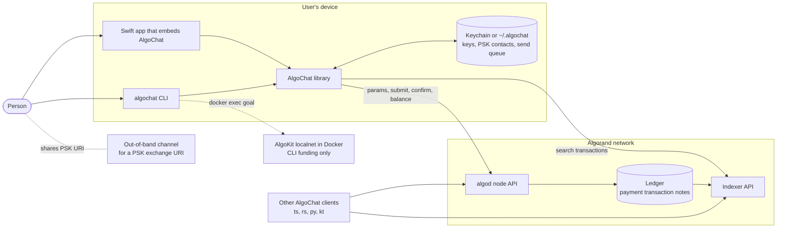

- **algod** is used for suggested transaction parameters, submission, confirmation waits and account balance
  ([`AlgoChat.swift`](../Sources/AlgoChat/AlgoChat.swift)).
- **Indexer** is used for every read: conversation history, key discovery and "is it visible yet" polling
  ([`MessageIndexer.swift`](../Sources/AlgoChat/Blockchain/MessageIndexer.swift)). `AlgoChat` refuses to start
  without one (`ChatError.indexerNotConfigured`).
- **Endpoints** come from `AlgorandConfiguration` in swift-algorand: `.localnet`, `.testnet`, `.mainnet` (the
  public AlgoNode endpoints in the resolved swift-algorand version) or `.custom(algodURL:indexerURL:)`. The CLI
  offers only Localnet and TestNet ([`AlgoChatCLI.swift`](../Sources/AlgoChatCLI/AlgoChatCLI.swift)).
- **Out-of-band channel**: PSK mode needs both people to hold the same 32-byte key. The library produces and parses
  an `algochat-psk://` URI; how it travels between people is up to them.
- **Localnet funding**: on localnet the CLI finds a funded KMD account and runs `goal clerk send` through
  `docker exec algokit_sandbox_algod`. This is a CLI convenience, not part of the library.

## 3. Components

### 3.1 Package targets

Defined in [`Package.swift`](../Package.swift) (swift-tools-version 6.0). Every target enables
`StrictConcurrency`. Platforms: iOS 15, macOS 12, tvOS 15, watchOS 8, visionOS 1, plus Linux (built in CI with the
`swift:6.0` container).

| Target | Product | Depends on | Owns |
|---|---|---|---|
| `AlgoChat` | library `AlgoChat` | `AlgoKit` (swift-algokit), `Algorand` (swift-algorand), `Crypto` (swift-crypto) | The whole protocol: key derivation, envelopes, encryption, transactions, indexer reads, PSK state, queue, storage |
| `AlgoChatCLI` | executable `algochat` | `AlgoChat`, `CLI` (swift-cli) | Interactive terminal client: network choice, account create or load, key storage prompts, conversations, localnet funding |
| `AlgoChatTests` | test target | `AlgoChat` | swift-testing suites for crypto, envelopes, models, queue, storage, indexer and localnet integration |

`swift-docc-plugin` is a package dependency used only by the documentation workflow. swift-algorand is held below
0.4.0 because 0.4.0 made `AlgorandConfiguration` factories throwing, which swift-algokit 0.0.2 does not compile
against (comment in `Package.swift`).

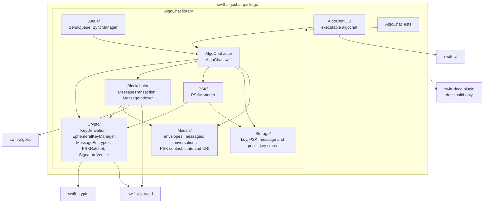

### 3.2 Modules inside the library

| Directory | Main types | Responsibility |
|---|---|---|
| [`AlgoChat.swift`](../Sources/AlgoChat/AlgoChat.swift) | `AlgoChat` (actor) | Public entry point: conversations, `send`, `sendPSK`, `refresh`, `loadOlder`, `loadCached`, key publish and discovery, balance, cache control, PSK contacts |
| [`Crypto/`](../Sources/AlgoChat/Crypto) | `KeyDerivation`, `EphemeralKeyManager`, `MessageEncryptor`, `PSKRatchet`, `SignatureVerifier` | Account-to-X25519 derivation, per-message key agreement, ChaCha20-Poly1305 seal and open, PSK ratchet and hybrid keys, Ed25519 key-announcement signatures, fingerprints |
| [`Models/`](../Sources/AlgoChat/Models) | `ChatAccount`, `ChatEnvelope`, `PSKEnvelope`, `EnvelopeDecoder`, `Message`, `ReplyContext`, `Conversation`, `DecryptedContent`, `DiscoveredKey`, `SendOptions`, `SendResult`, `PSKContact`, `PSKState`, `PSKExchangeURI` | Wire formats, decoded message model, conversation merge rules, send options, PSK counters and exchange URI. `MessagePayload` and `KeyPublishPayload` are internal |
| [`Blockchain/`](../Sources/AlgoChat/Blockchain) | `MessageTransaction`, `MessageIndexer` (actor), `TransactionSearching` | Build and sign payment transactions with the envelope as note; read, filter, decrypt and discover keys through the indexer; poll for indexer visibility |
| [`PSK/`](../Sources/AlgoChat/PSK) | `PSKManager` (actor) | PSK contacts and ratchet state, cached in memory in front of a `PSKStorage` |
| [`Queue/`](../Sources/AlgoChat/Queue) | `SendQueue` (actor), `PendingMessage`, `SendQueueStorage`, `InMemorySendQueueStorage`, `FileSendQueueStorage`, `SyncManager` (actor) | Offline send queue with retry counting, persistence and a sync loop that sends through `AlgoChat` |
| [`Storage/`](../Sources/AlgoChat/Storage) | `EncryptionKeyStorage` with `KeychainKeyStorage` and `FileKeyStorage`; `PSKStorage` with `FilePSKStorage`; `MessageCache` with `InMemoryMessageCache`; `PublicKeyCacheProtocol` with `PublicKeyCache`; `StorageDirectory` | Where private keys, PSK contacts, cached messages and discovered public keys live |
| [`Errors/`](../Sources/AlgoChat/Errors/ChatError.swift) | `ChatError` | Library error enum. `KeyStorageError` and `MessageCacheError` sit next to their protocols |

Concurrency model: everything that holds mutable state is an actor (`AlgoChat`, `MessageIndexer`, `PSKManager`,
`PublicKeyCache`, `SendQueue`, `SyncManager`, and every storage implementation). The crypto and transaction helpers
are stateless enums. `ChatAccount` and `Conversation` are `@unchecked Sendable` because swift-crypto's Curve25519
key types are not `Sendable`; the source comments record that reasoning.

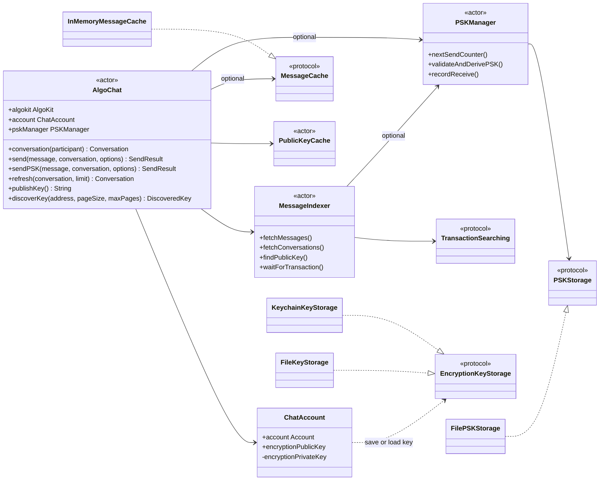

`AlgoChat`'s initializers take an Algorand `Account` and always build `ChatAccount(account:)`, which re-derives the
encryption key from the account's mnemonic. `EncryptionKeyStorage` is used by callers that build a `ChatAccount`
themselves (`ChatAccount(account:storage:)`, `saveEncryptionKey(to:)`); the CLI does this to store and reload the key,
then still hands the plain `Account` to `AlgoChat`.

## 4. Protocol

swift-algochat implements the two wire formats of protocol 1.1: standard mode (protocol byte `0x01`) and ratcheting
PSK mode (`0x02`). Protocol 1.2's optional Falcon-1024 account authorization has no code in this repository.

### 4.1 Identity and key derivation

- The Algorand account is an Ed25519 key pair; its address bytes are its Ed25519 public key. It signs every
  transaction.
- The X25519 encryption key is derived from the same secret
  ([`KeyDerivation.swift`](../Sources/AlgoChat/Crypto/KeyDerivation.swift)):
  `seed = Mnemonic.decode(account.mnemonic())` (32 bytes), then
  `private = HKDF-SHA256(ikm: seed, salt: "AlgoChat-v1-encryption", info: "x25519-key", length: 32)`.
- The derivation is deterministic, so the same mnemonic gives the same encryption key on every device and in every
  implementation that follows the protocol. The mnemonic is therefore the single root secret for both signing and
  decryption.
- The encryption public key reaches other people in two ways: it is the `sender_pubkey` field of every envelope a
  user sends, and it can be announced explicitly with a signed key-publish transaction (section 5.3).

### 4.2 Wire formats

Standard envelope, [`ChatEnvelope.swift`](../Sources/AlgoChat/Models/ChatEnvelope.swift):

| Offset | Bytes | Field |
|---|---|---|
| 0 | 1 | version `0x01` |
| 1 | 1 | protocol `0x01` |
| 2 | 32 | sender static X25519 public key |
| 34 | 32 | ephemeral X25519 public key, fresh per message |
| 66 | 12 | nonce |
| 78 | 48 | encrypted sender key: 32-byte message key plus 16-byte tag |
| 126 | n + 16 | ciphertext plus Poly1305 tag |

PSK envelope, [`PSKEnvelope.swift`](../Sources/AlgoChat/Models/PSKEnvelope.swift):

| Offset | Bytes | Field |
|---|---|---|
| 0 | 1 | version `0x01` |
| 1 | 1 | protocol `0x02` |
| 2 | 4 | ratchet counter, big-endian `UInt32` |
| 6 | 32 | sender static X25519 public key |
| 38 | 32 | ephemeral X25519 public key |
| 70 | 12 | nonce |
| 82 | 48 | encrypted sender key |
| 130 | n + 16 | ciphertext plus tag |

An Algorand note holds at most 1,024 bytes, so the largest plaintext is 1024 - 126 - 16 = **882 bytes** in standard
mode and 1024 - 130 - 16 = **878 bytes** in PSK mode (`maxPayloadSize`). `MessageTransaction` also refuses any
encoded note over 1,024 bytes.

Decoding ([`EnvelopeDecoder.swift`](../Sources/AlgoChat/Models/EnvelopeDecoder.swift)): a note counts as AlgoChat
when byte 0 is `0x01` and byte 1 is `0x01` or `0x02`. The protocol byte picks the envelope type; the decoder then
checks version and minimum length (header plus tag). Anything after the fixed header is taken as ciphertext, which
is why the key-publish signature is found by reading the last 64 bytes of the note. Envelope initializers re-base
every field to zero-indexed `Data` so indexing untrusted input cannot trap, and use `precondition` on field sizes.

Plaintext payloads ([`MessagePayload.swift`](../Sources/AlgoChat/Models/MessagePayload.swift)):

| Payload | Encoding |
|---|---|
| Ordinary message | UTF-8 text |
| Reply | JSON with sorted keys: `text` and `replyTo` (`txid`, `preview`). The preview is cut to 77 characters plus `...` when longer than 80 |
| Key publish | JSON `{"type":"key-publish"}` |

On decryption, a plaintext that starts with `{` and decodes as a reply payload becomes structured content; a
key-publish payload decrypts to `nil` and is dropped; anything else must be valid UTF-8 text.

### 4.3 Standard mode encryption

[`MessageEncryptor.swift`](../Sources/AlgoChat/Crypto/MessageEncryptor.swift) and
[`EphemeralKeyManager.swift`](../Sources/AlgoChat/Crypto/EphemeralKeyManager.swift). S is the sender's static key,
R the recipient's, E a fresh ephemeral key pair made for this one message.

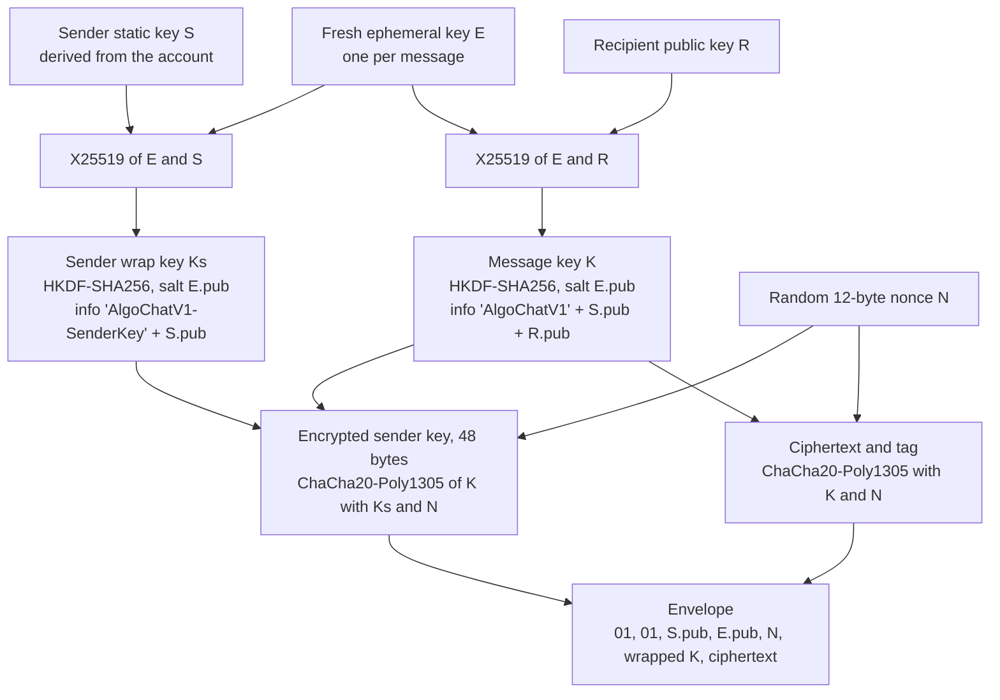

- The same nonce seals both the message and the wrapped key; the keys differ, which the source comments note is
  safe for ChaCha20-Poly1305.
- **Recipient decryption** computes X25519(R private, E.pub) and derives K with the same salt and info.
- **Sender decryption** ("bidirectional decryption") happens when the decryptor's public key equals the envelope's
  `sender_pubkey`: X25519(S private, E.pub) gives Ks, which unwraps K. This is what lets a sender re-read their own
  history from the chain on any device.
- Nonces come from `SecRandomCopyBytes` on Apple platforms and `/dev/urandom` elsewhere. Ephemeral keys come from
  swift-crypto's `Curve25519.KeyAgreement.PrivateKey()`.

### 4.4 PSK mode (protocol 1.1)

[`PSKRatchet.swift`](../Sources/AlgoChat/Crypto/PSKRatchet.swift),
[`PSKState.swift`](../Sources/AlgoChat/Models/PSKState.swift),
[`PSKManager.swift`](../Sources/AlgoChat/PSK/PSKManager.swift).

- **Ratchet.** For counter c:
  `session = HKDF(ikm: initialPSK, salt: "AlgoChat-PSK-Session", info: BE32(c / 100))`, then
  `PSK_c = HKDF(ikm: session, salt: "AlgoChat-PSK-Position", info: BE32(c % 100))`. All HKDF is SHA-256 with 32-byte
  output. Every position key is a deterministic function of the initial PSK.
- **Hybrid message key.**
  `K = HKDF(ikm: X25519(E, R) + PSK_c, salt: E.pub, info: "AlgoChatV1-PSK" + S.pub + R.pub)`.
- **Sender wrap key.**
  `Ks = HKDF(ikm: X25519(E, S) + PSK_c, salt: E.pub, info: "AlgoChatV1-PSK-SenderKey" + S.pub)`.
- **Send counter.** `PSKState.sendCounter` starts at 0 and advances by one per send (wrapping add). `PSKManager`
  persists the advanced state before returning the counter, so a crash cannot reuse it.
- **Receive window.** A counter is rejected if it is already in `seenCounters` (`pskCounterReplay`) or outside
  `[peerLastCounter - 200, peerLastCounter + 200]` (`pskCounterOutOfRange`). Validation and recording are two
  steps: the counter is recorded only after decryption succeeds, so a bad message cannot burn a counter. Seen
  counters older than the window are pruned.
- **Exchange URI** ([`PSKExchangeURI.swift`](../Sources/AlgoChat/Models/PSKExchangeURI.swift)):
  `algochat-psk://v1?addr=<address>&psk=<base64url of 32 bytes>&label=<optional>`. Parsing checks the scheme, the
  `v1` host, a non-empty `addr` and a PSK that decodes to exactly 32 bytes.

## 5. Key flows

### 5.1 Send a standard message

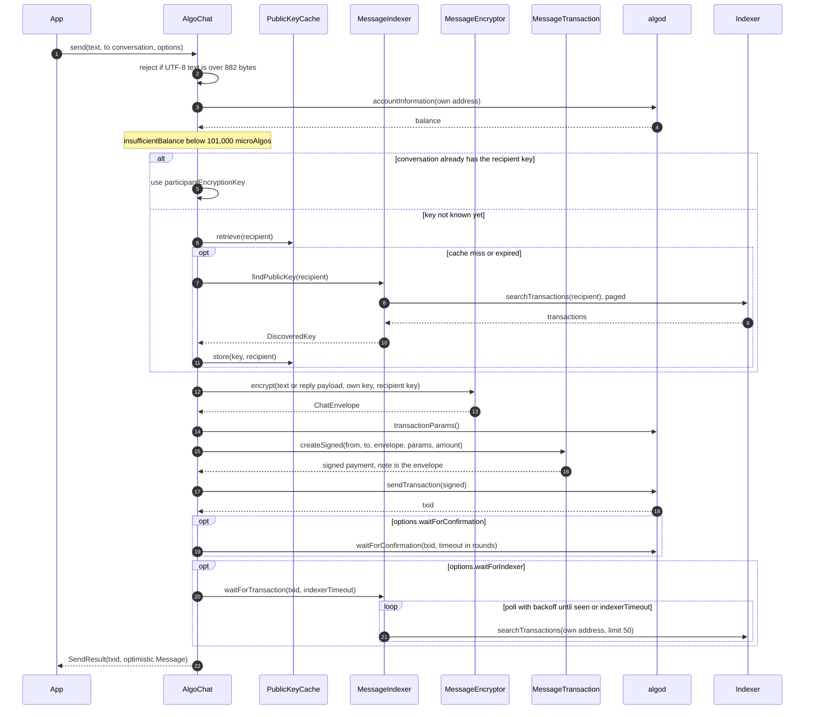

Notes, all from [`AlgoChat.swift`](../Sources/AlgoChat/AlgoChat.swift) and
[`SendOptions.swift`](../Sources/AlgoChat/Models/SendOptions.swift):

- The payment amount defaults to `MessageTransaction.minimumPayment` (1,000 microAlgos) and can be overridden with
  `SendOptions.amount`. The suggested parameters supply the validity window (first valid round plus 1,000) and the
  genesis ID and hash. The fee is the flat 1,000 microAlgos default of swift-algorand's `PaymentTransactionBuilder`
  (resolved version 0.3.2); the code does not set it from the suggested parameters.
- `.default` returns right after submission, `.confirmed` waits for algod, `.indexed` waits for algod and then the
  indexer. `.replying(to:)` and `.withAmount(_:)` build the other variants.
- The returned `Message` is optimistic: its timestamp is the local clock and its `confirmedRound` is 0 unless the
  call waited for confirmation.
- Sending to yourself uses your own encryption key directly.

### 5.2 Receive: refresh a conversation

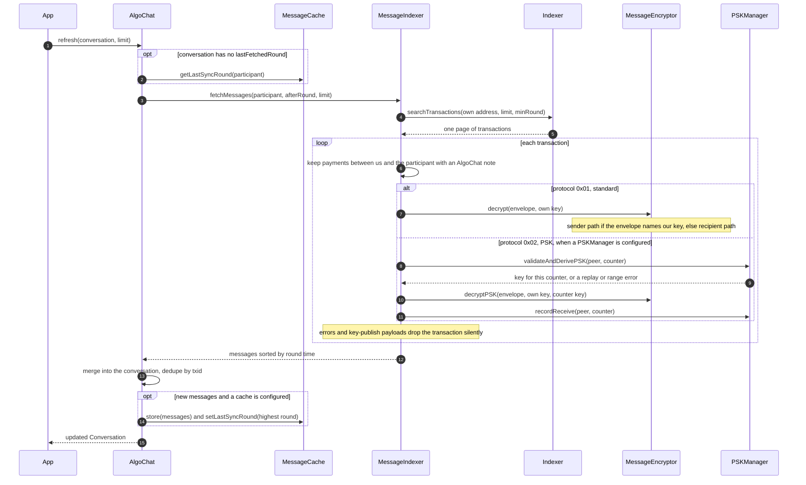

- `conversations(limit:)` runs the same filter over one page of the account's transactions, groups messages by the
  other party and sorts conversations by their latest message ([`MessageIndexer.fetchConversations`](../Sources/AlgoChat/Blockchain/MessageIndexer.swift)).
- `loadOlder(_:limit:)` pages backwards with `maxRound` set just below the oldest known round.
- `loadCached(for:)` reads only the local `MessageCache`, for offline display.
- If the conversation had no recipient key and a received message arrived, `refresh` also looks the key up so the
  next send does not have to.

### 5.3 Publish and discover an encryption key

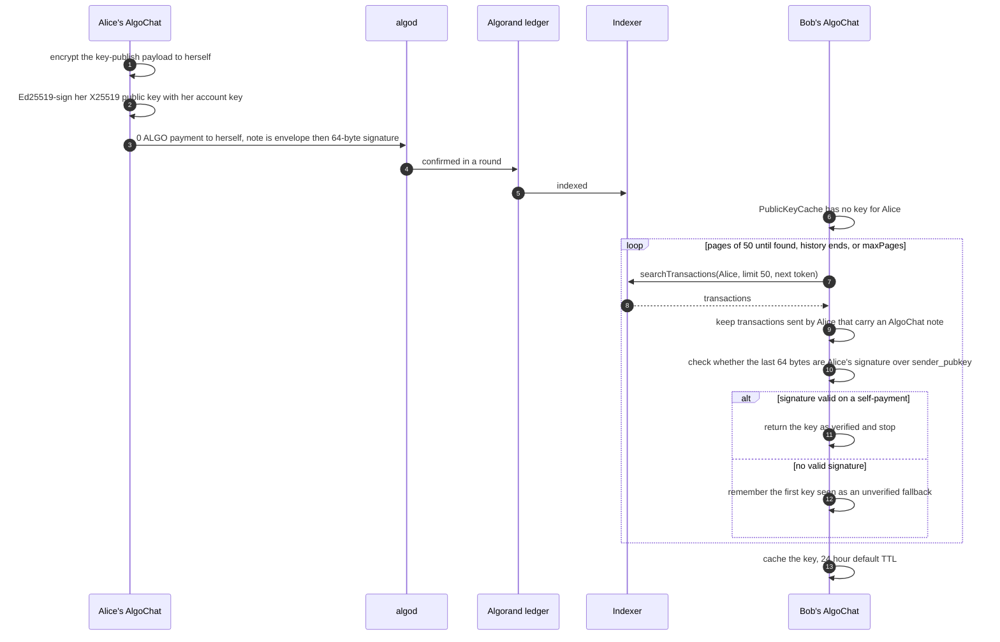

- `publishKey()` returns the txid; `publishKeyAndWait(timeout:)` also waits for confirmation. The key-publish
  transaction never appears as a message: the indexer drops notes that fail to decrypt and payloads that are
  key-publish.
- `discoverKey(for:pageSize:maxPages:)` returns a `DiscoveredKey` with `isVerified`. `fetchPublicKey(for:)`, which
  `send` uses, returns just the key, verified or not, and caches it
  ([`MessageIndexer.findPublicKey`](../Sources/AlgoChat/Blockchain/MessageIndexer.swift),
  [`SignatureVerifier.swift`](../Sources/AlgoChat/Crypto/SignatureVerifier.swift)).
- `SignatureVerifier.fingerprint(of:)` renders the first 8 bytes of SHA-256 of a key as four hex groups for
  comparing keys out of band.

### 5.4 Set up a PSK contact and exchange a PSK message

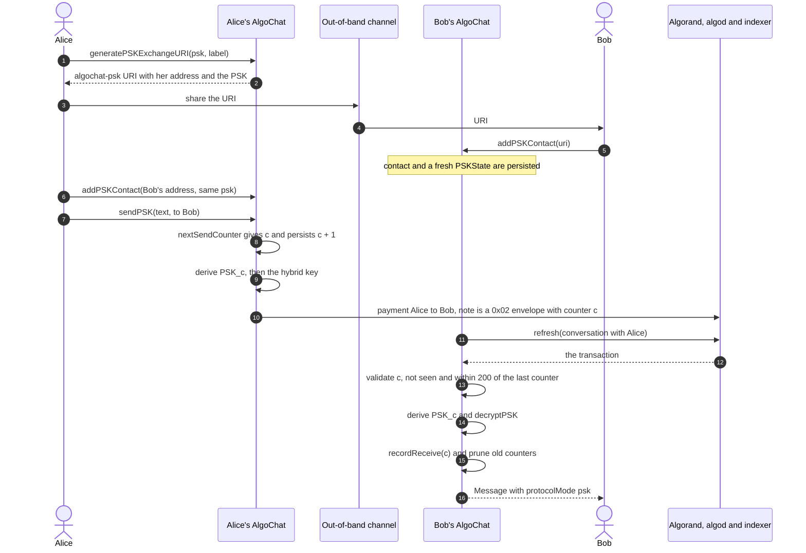

- `generatePSKExchangeURI` does not add a contact. Both sides must call `addPSKContact` with the same 32 bytes;
  `sendPSK` throws `pskNotFound` without one, and `AlgoChat` only has a `PSKManager` when it was created with a
  `pskStorage`.
- Standard and PSK messages coexist in one conversation; each decrypted `Message` records its `protocolMode`.

### 5.5 Offline queue and sync

[`SendQueue.swift`](../Sources/AlgoChat/Queue/SendQueue.swift),
[`PendingMessage.swift`](../Sources/AlgoChat/Queue/PendingMessage.swift),
[`SyncManager.swift`](../Sources/AlgoChat/Queue/SyncManager.swift).

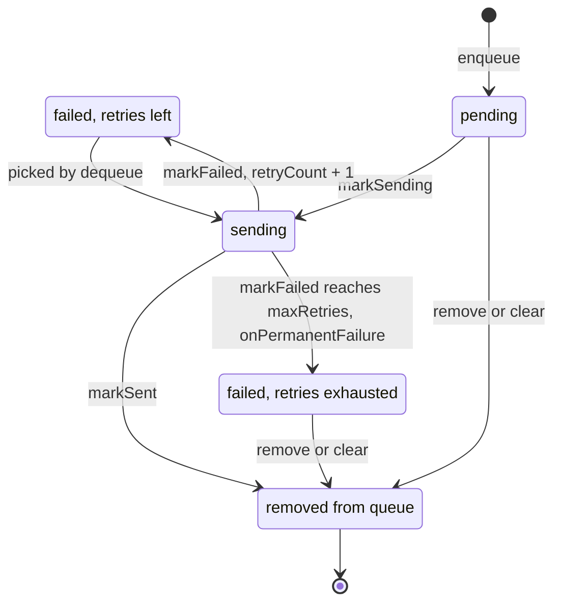

- `SendQueue` keeps messages in FIFO order; `dequeue` returns the first `pending` message or `failed` one with
  retries left (default `maxRetries` is 3). Every change is persisted through `SendQueueStorage`.
- `SyncManager.sync(using:)` drains the queue through `AlgoChat.send` with `waitForConfirmation: true`. An error in
  `NSURLErrorDomain` marks the manager offline and stops the loop.

## 6. Data

### 6.1 On-chain

Every AlgoChat record is an Algorand payment transaction ([`MessageTransaction.swift`](../Sources/AlgoChat/Blockchain/MessageTransaction.swift)):

| Field | Message | Key publish |
|---|---|---|
| sender | the author's address | the publisher's address |
| receiver | the recipient's address | the publisher's own address |
| amount | 1,000 microAlgos by default, or `SendOptions.amount` | 0 |
| note | standard or PSK envelope | standard envelope, then a 64-byte Ed25519 signature |
| fee | 1,000 microAlgos, the swift-algorand builder default | same |
| validity | first valid round from algod's suggested parameters, plus 1,000 rounds | same |

The indexer adds the txid (used as `Message.id`), the confirmed round and the round time (used as
`Message.timestamp`). Nothing else is stored on-chain; there are no smart contracts or application state.

### 6.2 In-memory model

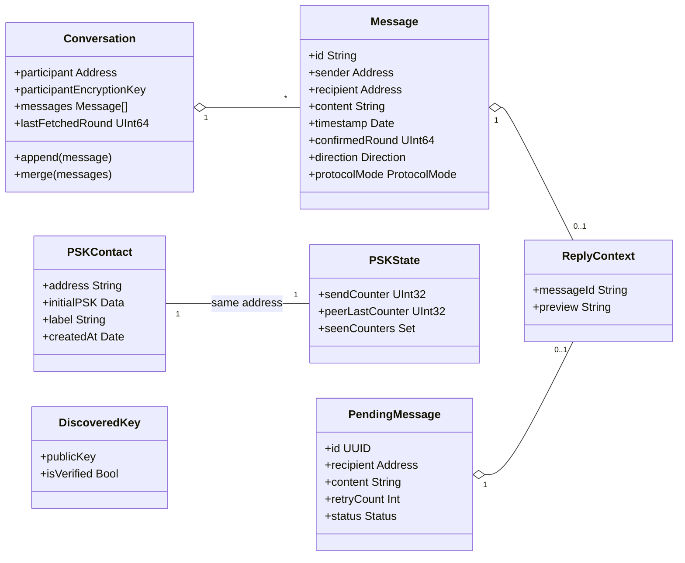

- `Message` equality and hashing use only `id` (the txid). `Conversation.append` ignores a txid it already has and
  keeps messages sorted by timestamp.
- Direction is relative to the local account: `sent` when the transaction sender is us, `received` otherwise.

### 6.3 Local persistence

| Store | Where | Contents and protection |
|---|---|---|
| `KeychainKeyStorage` on iOS, macOS, visionOS | Keychain generic password, service `com.algochat.encryption-keys`, account = address | 32-byte X25519 private key, `kSecAttrSynchronizable` false. With biometrics: `kSecAttrAccessibleWhenPasscodeSetThisDeviceOnly` plus `.userPresence`; without: `kSecAttrAccessibleWhenUnlockedThisDeviceOnly` |
| `KeychainKeyStorage` elsewhere (tvOS, watchOS, Linux) | process memory | Same API, in-memory dictionary, lost when the process exits |
| `FileKeyStorage` | `~/.algochat/keys/<address>.key` | 92 bytes: salt 32, nonce 12, ciphertext 32, tag 16. AES-256-GCM with a key from PBKDF2-HMAC-SHA256 over the password, 100,000 iterations. File mode 0600 on macOS and Linux |
| `FilePSKStorage` | `~/.algochat/psk/<address>.contact.json` and `.state.json` | JSON, not encrypted; the contact file holds the initial PSK. The `psk` directory is created 0700 on macOS and Linux; files take the process umask. Addresses containing path separators, `..` or NUL are refused |
| `FileSendQueueStorage` | `~/.algochat/queue.json` | Pending messages as JSON, including plaintext content. File mode 0600 on macOS and Linux; deleted when the queue is empty |
| `PublicKeyCache` | memory | Discovered X25519 public keys by address, 24-hour default TTL |
| `InMemoryMessageCache` | memory | Messages and last-sync round per participant. Apps can supply their own persistent `MessageCache` |

`StorageDirectory` ([source](../Sources/AlgoChat/Storage/StorageDirectory.swift)) resolves the base directory:
`$HOME/<name>` on Linux (falling back to `/tmp/<name>`), the home directory on macOS, and Application Support on
other Apple platforms. It creates the directory with mode 0700 on macOS and Linux. The library never stores the
mnemonic.

## 7. Runtime and deployment

swift-algochat is a SwiftPM source package. Consumers depend on a git tag; nothing is deployed and no binaries are
published. The `algochat` CLI is built and run from source (`swift run algochat`).

Local verification is defined in [`fledge.toml`](../fledge.toml): tasks `build`, `test-crypto`, `test-unit` and
`cli`, chained by the `verify` lane (`fledge lanes run verify`). `fledge trust verify` runs that lane plus the
SpecSync contract check, the Augur risk gate and Attest provenance ([`.trust.toml`](../.trust.toml)).

| Workflow | Trigger | What it does |
|---|---|---|
| [`trust.yml`](../.github/workflows/trust.yml) | every pull request, push to `main` | CorvidLabs Trust gate, pinned by commit SHA, in the `swift:6.0` container. `trust` is the required status check on `main` |
| [`macOS.yml`](../.github/workflows/macOS.yml) | pull request or push touching `Sources/`, `Tests/`, `Package.swift`, `Package.resolved` | Build and two filtered test batches on `macos-latest` |
| [`linux.yml`](../.github/workflows/linux.yml) | same paths | Build and two test batches in `swift:6.0`, plus a CLI product build |
| [`docs.yml`](../.github/workflows/docs.yml) | push to `main` touching `Sources/`, `Package.swift` or the workflow | DocC static site, deployed to GitHub Pages |
| [`release.yml`](../.github/workflows/release.yml) | tag `X.Y.Z` or `vX.Y.Z` | Build, full `swift test`, `gh release create` with generated notes |

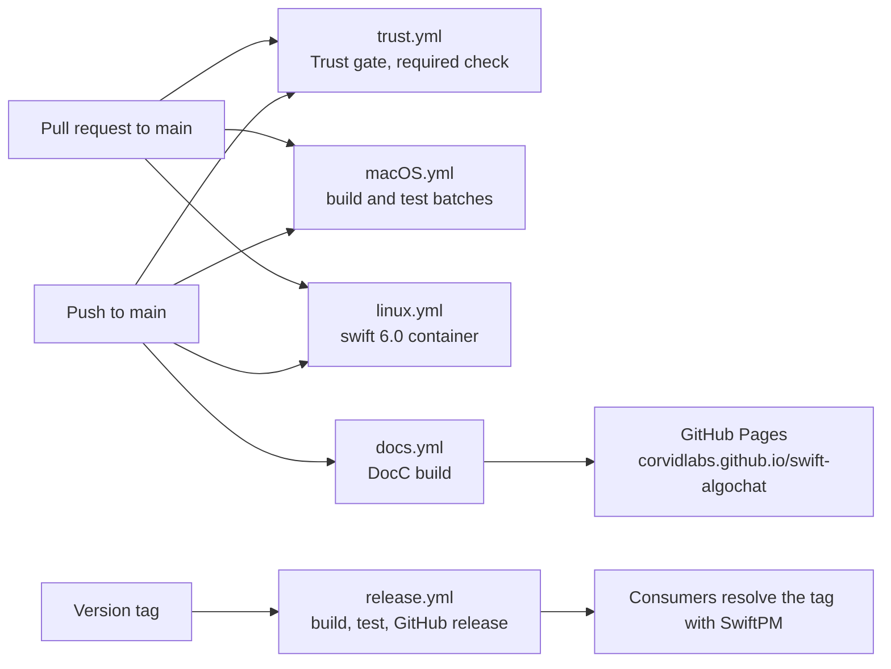

- CI runs tests in two filtered batches because many concurrent crypto suites crash CryptoKit or BoringSSL on the
  runners, and it leaves out the heaviest crypto, end-to-end and localnet suites. The workflow files list the
  exclusions.
- Localnet integration tests need `algokit localnet start` and are run by hand ([README](../README.md)).
- The API reference is published at <https://corvidlabs.github.io/swift-algochat/documentation/algochat/>.

## 8. Security and trust boundaries

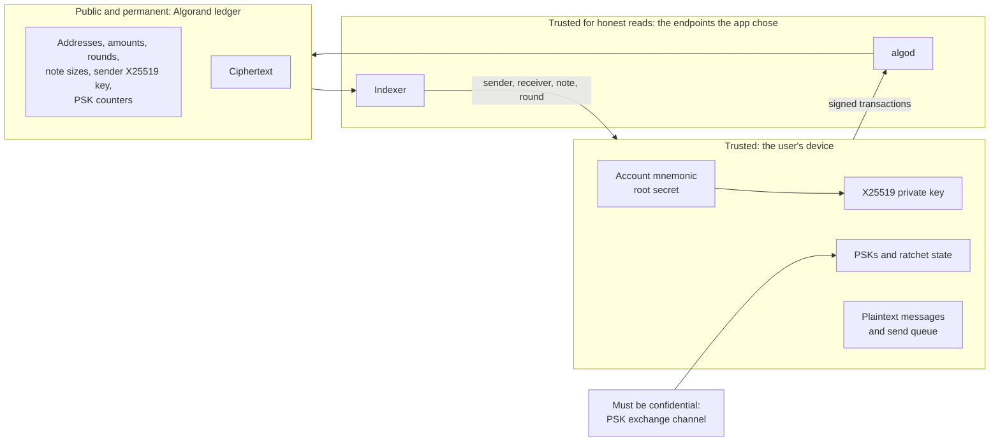

What is protected:

- **Content confidentiality and integrity.** ChaCha20-Poly1305 over every message; a changed byte fails
  authentication. Standard messages can be read with either party's static X25519 private key. PSK messages also
  need the PSK.
- **Key ownership, when verified.** A key announced with `publishKey()` carries an Ed25519 signature by the
  address over the X25519 key, checked against the address bytes during discovery.

What is not protected, or rests on something else:

- **Metadata is public and permanent**: both addresses, amount, round and time, note size, the sender's X25519
  public key, the protocol byte and, in PSK mode, the counter.
- **No forward secrecy.** The ephemeral key separates per-message keys, but either party's static private key, or
  the mnemonic it comes from, decrypts every standard message that account ever sent or received, because the
  ciphertext stays on-chain. PSK mode raises the bar to the static key plus the PSK. This matches protocol
  [section 11.1](https://github.com/CorvidLabs/protocol-algochat/blob/main/PROTOCOL.md#111-forward-secrecy--not-provided).
- **Sender identity comes from the Algorand transaction as the indexer reports it.** The client does not
  re-verify transaction signatures; it trusts the indexer's `sender` field, and the chain accepted the
  transaction only with a valid signature. Standard envelopes carry no signature over the content; only
  key-publish notes carry one.
- **Unverified keys are accepted for sending.** When no signed key-publish exists, discovery returns the first
  `sender_pubkey` it finds in a transaction sent by that address, marked unverified. `send` uses it without
  exposing the flag; callers who care should use `discoverKey` or compare fingerprints.
- **Replay** is checked only in PSK mode. Standard mode relies on transaction uniqueness on the ledger.

Secrets handling:

- The library holds keys only in memory and in the stores in section 6.3. It never writes the mnemonic. The CLI
  reads the mnemonic through a secret prompt.
- PSK contact files and the send queue are plain JSON on disk; their safety depends on file permissions and the
  device.
- The repository contains no keys or tokens. The only credential-like value in the source is the well-known
  AlgoKit localnet API token used by the CLI's localnet mode.
- Vulnerabilities are reported privately, per [SECURITY.md](../SECURITY.md).

## 9. Failure modes and limits

| Situation | Behavior | Source |
|---|---|---|
| No indexer in the configuration | `AlgoChat.init` throws `indexerNotConfigured` | `AlgoChat.swift` |
| Text too long | `messageTooLarge(maxSize: 882)` standard, `878` PSK; reply JSON counts toward the limit | `AlgoChat.swift`, `MessageEncryptor.swift` |
| Balance below 101,000 microAlgos | `insufficientBalance` before any network write. The check ignores a custom `amount`, so a larger payment can still be rejected by algod | `AlgoChat.swift` |
| Recipient has never sent an AlgoChat transaction or published a key | `publicKeyNotFound` from `send`; `conversation(with:)` returns a conversation without a key instead of throwing | `AlgoChat.swift`, `MessageIndexer.swift` |
| Busy address during key discovery | Exhaustive paging by default, 50 per page, one indexer call per page; `maxPages` bounds it | `MessageIndexer.findPublicKey` |
| Confirmation wait runs out | Error from swift-algorand's `waitForConfirmation`; `timeout` is in rounds (default 10) | `AlgoChat.swift`, `SendOptions.swift` |
| Indexer never shows the transaction | `waitForTransaction` polls every 0.5 s growing by 1.5 times to 5 s, with 20 percent jitter, until `indexerTimeout` (30 s default), then returns `false`; `send` does not throw | `MessageIndexer.swift` |
| A note that does not decode or decrypt | Skipped silently; never surfaced as an error | `MessageIndexer.fetchMessages` |
| Large histories | `fetchMessages` and `fetchConversations` make one indexer request of `limit` transactions for the account and filter locally; they do not follow the `next` token, so `conversations()` sees only that page | `MessageIndexer.swift` |
| Several messages in one round | Messages sort by round time, whole seconds per block, so messages confirmed in the same round share a timestamp and their relative order does not come from the chain | `Conversation.swift`, `MessageIndexer.swift` |
| PSK counter far ahead or replayed | Rejected; the transaction is dropped from results | `PSKState.swift` |
| Re-reading PSK history | Counters are recorded on first successful decryption, and a counter already in `seenCounters` is rejected as a replay. From reading the code, a PSK message fetched a second time against the same stored state, for example by a later `conversations()` call, is dropped. Sent and received PSK messages with the same peer share one `PSKState`. No test covers this | `MessageIndexer.parseMessage`, `PSKManager.swift` |
| PSK message without a configured `PSKManager` | Skipped | `MessageIndexer.parseMessage` |
| Queued message persisted as `sending` (process killed mid-send) | `dequeue` only returns `pending` or retryable `failed` messages, so it is not retried automatically | `SendQueue.swift` |
| `SyncManager.setOnline(true)`, `syncIfNeeded()`, `retry(_:)` | These call `sync(using: nil)`, which returns without sending. Queued messages go out only when the app calls `sync(using:)` with a client | `SyncManager.swift` |
| Keychain on tvOS, watchOS, Linux | In-memory fallback; keys do not survive a restart | `KeychainKeyStorage.swift` |
| Wrong password or corrupt key file | `KeyStorageError.decryptionFailed` or `invalidKeyData`; no key is returned | `FileKeyStorage.swift` |
| Network asks for more than the minimum fee | The fee stays at the builder's flat 1,000 microAlgos; nothing raises it, so algod may reject the transaction | `MessageTransaction.swift` |
| Rate limits on public endpoints | **Unknown.** No rate-limit handling or retry exists for algod or indexer calls, apart from the indexer-visibility poll | none |

## 10. Decisions

There is no `DECISIONS.md` or ADR directory. Decisions are recorded in the SpecSync contract and change history:

- [`specs/algochat/context.md`](../specs/algochat/context.md): key decisions and files to read first.
- [`specs/algochat/requirements.md`](../specs/algochat/requirements.md): normative requirements `REQ-algochat-001`
  to `REQ-algochat-012`, and [`specs/algochat/algochat.spec.md`](../specs/algochat/algochat.spec.md) for the exported
  API inventory.
- [`.specsync/changes/`](../.specsync/changes): CHG-0001 to CHG-0004, the SpecSync and Trust adoption and follow-ups.
- [`CHANGELOG.md`](../CHANGELOG.md) and [`SECURITY.md`](../SECURITY.md).

The big ones, summarized:

1. **The chain is the transport; the indexer is the read plane; caches are accelerators, not authorities**
   (`context.md`). There is no server to run or trust.
2. **The account is the identity.** The X25519 key is derived from the mnemonic, so there is nothing extra to back
   up or exchange, and every implementation derives the same key.
3. **Bidirectional decryption.** Each envelope wraps the message key for the sender, so history can be re-read from
   the chain on any device instead of being kept as local plaintext. The cost is that the sender's static key
   also decrypts every message they sent.
4. **PSK mode is optional defense in depth**, layered on ECDH rather than replacing it, with a deterministic ratchet
   and a replay window (`context.md`, CHANGELOG 0.3.0).
5. **A protocol byte selects the envelope**, so standard and PSK messages coexist and new modes can be added without
   breaking old readers.
6. **Storage and transport sit behind async `Sendable` protocols** (`EncryptionKeyStorage`, `PSKStorage`,
   `MessageCache`, `SendQueueStorage`, `TransactionSearching`) so apps and tests can substitute implementations.
7. **Real PBKDF2-HMAC-SHA256** for file key storage, interoperable with the reference implementations (CHANGELOG,
   Unreleased).

## 11. Where the docs and the code disagree

Found while writing this document. The code is described above as it is; these are for the maintainers to resolve.

- [README](../README.md) shows `FilePSKStorage(directory: ".algochat")` and
  `FileKeyStorage(directory: ".algochat", password: "secret")`. The initializers are
  `FilePSKStorage(directoryName:)` and `FileKeyStorage(password:)`.
- The `AlgoChat.send` doc comment says "max ~962 bytes" and the CLI's `maxMessageBytes` is 962. The enforced limit
  is 882 bytes (878 in PSK mode).
- README and [SECURITY.md](../SECURITY.md) describe forward secrecy for past messages. The code, and protocol section
  11.1, give per-message key separation without forward secrecy (section 8).
- SECURITY.md says the key-derivation salt is derived from the account address and uses the `"AlgoChatV1"` label.
  The code uses the fixed salt `"AlgoChat-v1-encryption"` and info `"x25519-key"`; `"AlgoChatV1"` labels the
  per-message key.
- SECURITY.md says keys never leave the Secure Enclave. The code stores the X25519 key as a Keychain generic-password
  item; no Secure Enclave key is involved.
- SECURITY.md lists the unique nonce as replay protection. Standard mode has no client-side replay check; only PSK
  mode has one.

## 12. Glossary

| Term | Meaning |
|---|---|
| algod | The Algorand node REST API: suggested parameters, submission, confirmation, account state |
| Indexer | The Algorand indexer REST API: searchable transaction history |
| Round | An Algorand block; `confirmedRound` is the block a transaction landed in |
| Note | The up to 1,024-byte free-form field of an Algorand transaction; AlgoChat puts its envelope there |
| microAlgo | One millionth of an ALGO; fees and amounts are in microAlgos |
| Envelope | The binary AlgoChat record in a note: header, keys, nonce, wrapped key, ciphertext |
| Standard mode | Protocol `0x01`: X25519 ephemeral agreement with ChaCha20-Poly1305 |
| PSK mode | Protocol `0x02`: standard mode plus a pre-shared key mixed into every message key |
| Ratchet counter | The per-message PSK counter; picks the session (counter / 100) and position (counter % 100) key |
| Key publish | A 0 ALGO self-payment whose note announces and signs the account's X25519 key |
| Sender key | The message key encrypted for the sender, so the sender can decrypt their own message |
| X25519, Ed25519 | Curve25519 key agreement and signatures; Algorand accounts are Ed25519 |
| HKDF | HMAC-based key derivation (RFC 5869), here always with SHA-256 |
| ChaCha20-Poly1305 | Authenticated encryption (RFC 8439) used for every message |
| AlgoKit (library) | CorvidLabs' Swift toolkit, swift-algokit, that wraps the algod and indexer clients |
| AlgoKit CLI, localnet | The Algorand Foundation's `algokit` command; `algokit localnet start` runs a local Algorand network in Docker |
| DocC | Apple's documentation compiler, used for the API reference site |
| SpecSync, Trust | CorvidLabs' contract checker and the combined verification gate every change passes |
